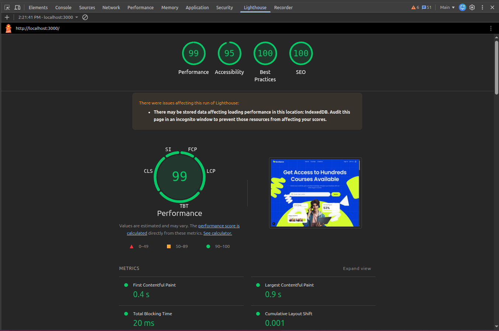

# ByteSpace New 🚀

A responsive implementation of the **ByteSpace New** Figma design, built for the **Jr. Software Engineer (Frontend) assessment**.

## 🔗 Links

* 🌐 **Live Demo:** [Vercel](https://bytespace-assessment-asik.vercel.app/)
* 💻 **Repository:** [GitHub](https://github.com/md-asikuzzaman/bytespace-frontend)
* 🎨 **Design:** [Figma](https://www.figma.com/design/26TBgRjmpuxudcErJsHUfy/ByteSpace-New-Check-website?node-id=0-1&p=f&t=eQOrqJmq6rMG5b6L-0)

## ✨ Features

* Responsive landing page
* Sign In & Sign Up pages
* Form validation with **Zod + React Hook Form**
* Smooth micro-interactions with **Framer Motion**
* Scroll-triggered staggered animations
* Responsive design for desktop, tablet & mobile
* SEO metadata
* Accessible form elements and semantic HTML
* Optimized images with Next.js
* Lighthouse tested

## 🛠️ Tech Stack

* Next.js
* TypeScript
* Tailwind CSS
* React Hook Form
* Zod
* Framer Motion

## 📊 Lighthouse

Performance, Accessibility, Best Practices, and SEO were tested using Lighthouse.



## 🚀 Run Locally

```bash
git clone https://github.com/md-asikuzzaman/bytespace-frontend
cd bytespace-frontend
pnpm install
pnpm dev
```

Open `http://localhost:3000`.

## 🌿 Git Workflow

The project was developed using a separate feature branch and submitted through a Pull Request.

```text
main
  └── feature/landing-page
          └── Pull Request → main
```

## 📌 Assessment

**Position:** Jr. Software Engineer (Frontend)
**Tracking ID:** `42a366e6-6dda-4823-a322-328d81831c23`
**Deadline:** October 01, 2026

## 👨‍💻 Author

**Md Asikuzzaman**

* GitHub: [@md-asikuzzaman](https://github.com/md-asikuzzaman)
* Portfolio: [devasik.vercel.app](https://devasik.vercel.app/)

---

<p align="center">
  Built with Next.js, TypeScript, Tailwind CSS & Framer Motion.
</p>
